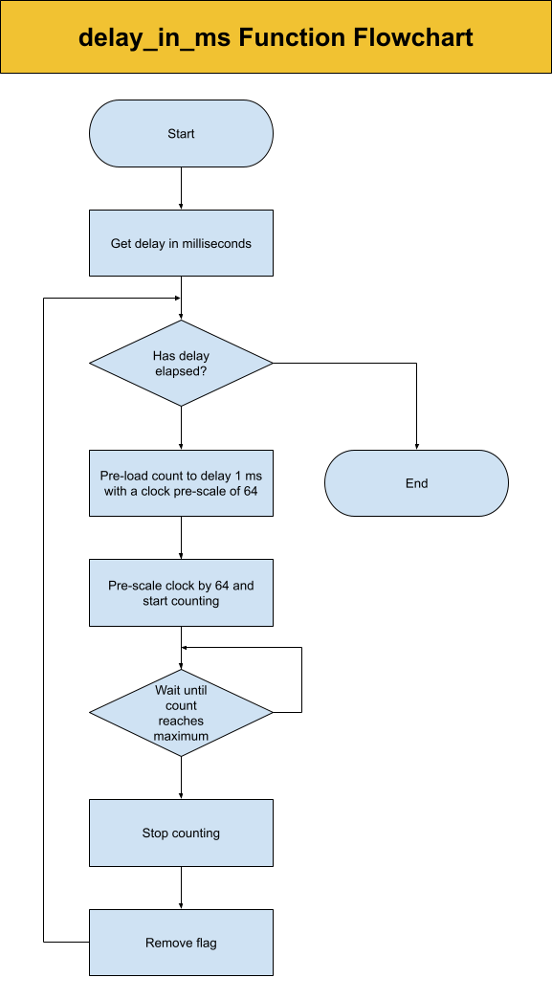
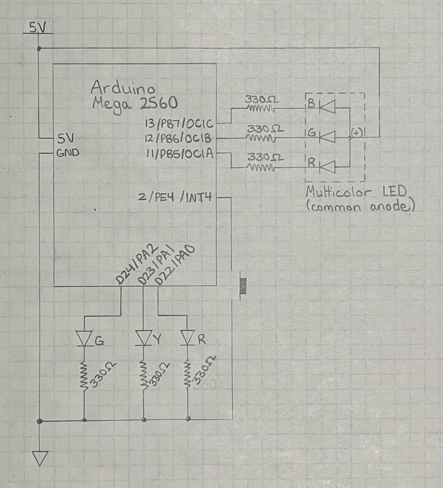
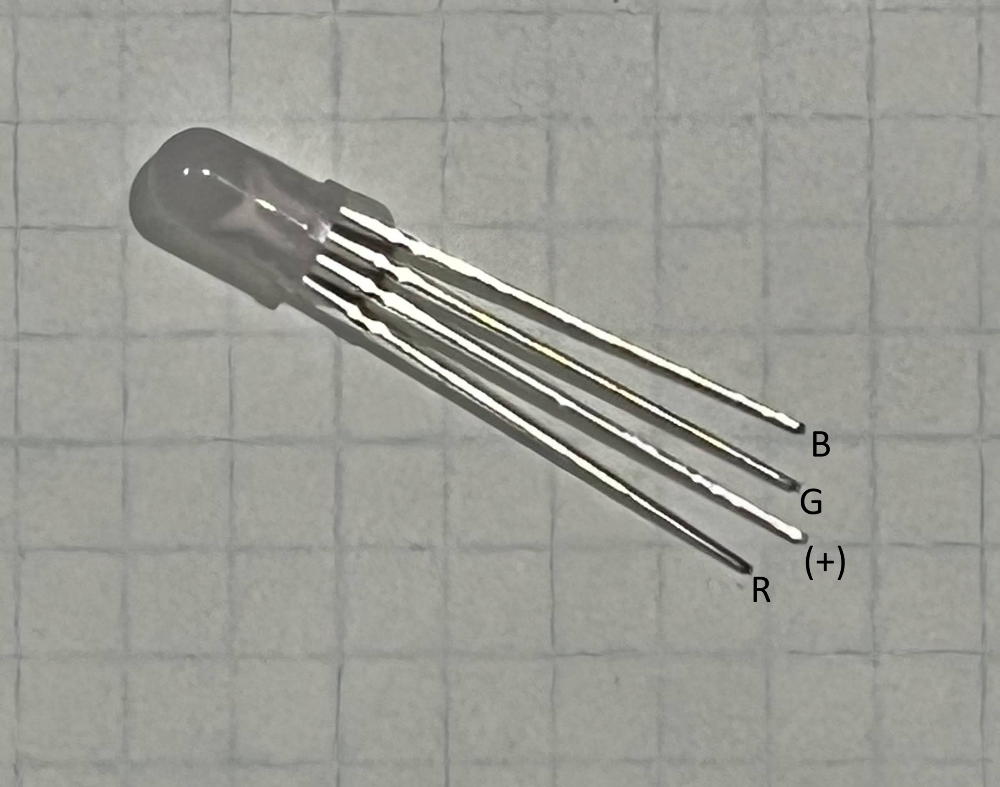
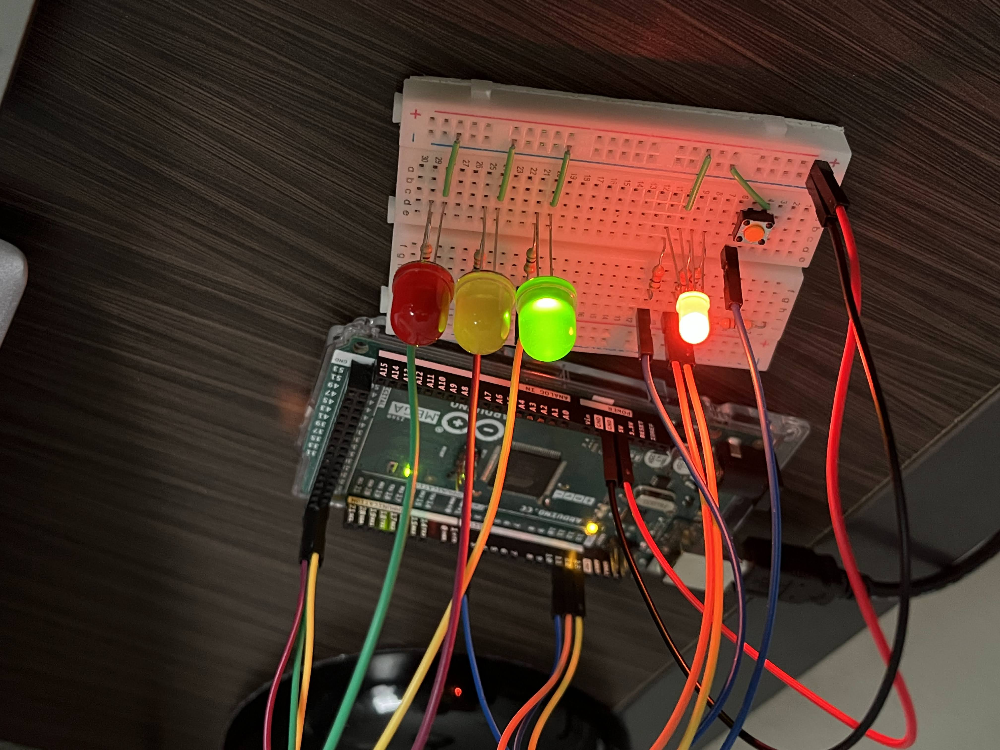
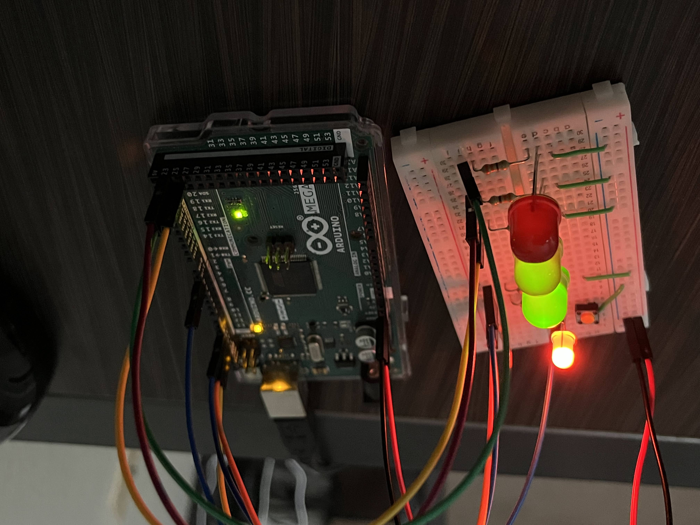

# jliang602_Traffic_Light

This program will simulate a signalized crosswalk with a traffic light and pedestrian signal using an Arduino Mega 2560 microcontroller. The traffic light is represented by a green, yellow, and red LED. The pedestrian signal is represented with a multicolor LED with white for the walk signal and orange for the don't walk signal.

The traffic light stays green and then changes when a pedestrian appraoches the crosswalk and presses the button. The pedestrian signal cycle will start after the traffic light turns red. After the pedestrian signal cycle is done, the traffic light will change back to green. There is a cooldown before the traffic light can change again for a pedestrian.

The delay was self-created using a Arduino Mega 2560 timer. Below is the flowchart for just the timer.

Here is the circuit schematic.

Also included for reference is the pinout for the multicolor LED.

The images below show the hardware setup.
 

The codes can be found [here](Traffic_Light/Traffic_Light).
