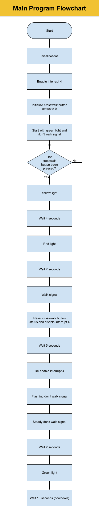

# jliang602_Traffic_Light

This program will simulate a signalized crosswalk. The vehicle traffic light will use green, yellow, and red. It stays green and then changes when a pedestrian appraoches the crosswalk and presses the button. The walk sign will appear once the traffic light turns red. After the pedestrian signal cycle is done, the traffic light will change back to green. The image below shows the flowchart for the main program.

